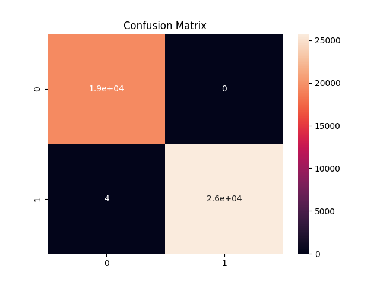

## Results

- Accuracy: 100%
- Precision: 1.00
- Recall: 1.00
- F1-score: 1.00

### Confusion Matrix

## 📊 Dataset

This project uses the CICIDS2017 dataset for cybersecurity threat detection.

🔗 Download dataset from:
https://www.kaggle.com/datasets/chethu-hun/network-intrusion-dataset

📁 After downloading:

* Extract the files
* Move the required CSV file into the `data/` folder

⚠️ Note: Dataset is not included in this repository due to large file size.
